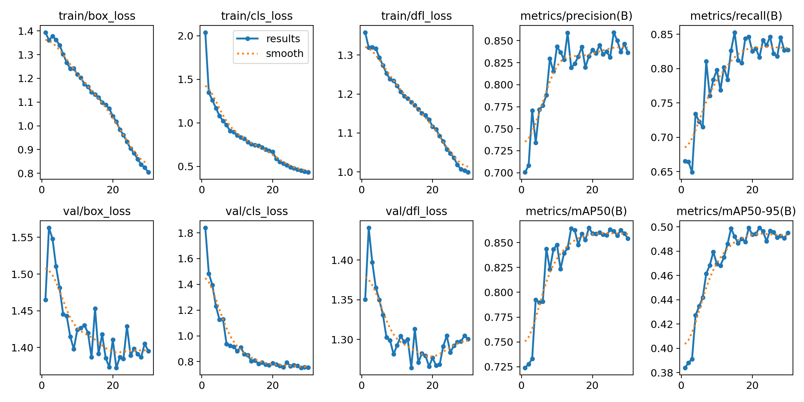

readme = """# 🪖 Helmet Safety Detection – YOLOv8 Fine-Tuning

A computer vision project that fine-tunes a pretrained YOLOv8 model to detect helmet usage among motorbike riders, built as a hands-on application of object detection concepts.

---

## 🎯 Objective
Fine-tune YOLOv8n on a public helmet detection dataset to classify motorbike riders as wearing or not wearing a helmet, and log evaluation metrics throughout training.

---

## 📦 Dataset
- **Source:** [Roboflow Universe – Helmet Detection Dataset](https://universe.roboflow.com/helmet-detection-nmzik/helmet-detection-nsbwm)
- **Size:** 1,540 images
- **Classes:** `Helmet`, `NoHelmet`, `Motorbike`, `PNumber`
- **Format:** YOLOv8 (pre-split into train/val/test)

---

## 🔧 Approach
1. Ran inference with pretrained YOLOv8n (COCO, 80 classes) to verify setup
2. Fine-tuned on the helmet dataset for 30 epochs
3. Logged and analyzed mAP, Precision, and Recall per epoch
4. Tested the best model checkpoint on unseen images

---

## 📊 Results

### Overall (Best Checkpoint)
| Metric | Score |
|---|---|
| mAP@50 | 86.2% |
| Precision | 85.8% |
| Recall | 81.2% |
| mAP@50-95 | 50.2% |

### Per Class
| Class | mAP@50 | Precision | Recall |
|---|---|---|---|
| Motorbike | 92.4% | 89.8% | 90.2% |
| Helmet | 88.2% | 88.2% | 81.0% |
| NoHelmet | 85.5% | 81.9% | 82.3% |
| PNumber | 78.8% | 83.2% | 71.5% |

---

## 📈 Training Curves


All three losses (box, cls, dfl) decreased consistently across 30 epochs. Validation losses followed the same trend, confirming no overfitting.

---

## 🛠️ Tools & Libraries
- Python
- YOLOv8 (Ultralytics)
- Google Colab (Tesla T4 GPU)
- Roboflow
- PyTorch

---

## 🚀 How to Run

```bash
pip install ultralytics roboflow
```

Then open `yolov8_object_detection.ipynb` in Google Colab and run all cells.

---

## 💡 Key Observations
- Motorbike class achieved the highest mAP (92.4%) — large distinctive shape is easier to detect
- PNumber had the lowest recall (71.5%) — license plates are small and sometimes blurry
- Model correctly classified helmet/no-helmet even on out-of-distribution close-up images
- Training converged around epoch 15; losses plateaued confirming 30 epochs was sufficient
"""

with open('README.md', 'w') as f:
    f.write(readme)

print("README.md created ✅")
